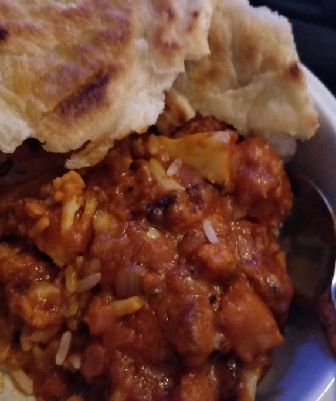

# Vegan Butter Chicken

Butter Chicken ganz ohne Chicken. Dafür noch viel besser!

dazu Ca 250g (ungekocht) Reis und selbstgemachtes Naan-Brot

*Hauptgericht, Vegan, Indisch*

**2 Portionen**

---

- *0,5 Stück* Blumenkohl
- *2 EL* Pflanzenöl
- *1 Stück* Zwiebel (mittelgroß)
- *2 Stück* Knoblauchzehe
- *1 TL* Ingwer
- *3 EL* Alsan
- *2 EL* Garam Massala (ersatzweise Tikki Massala)
- *70 g* Tomatenmark
- *1 Stück* Kokosmilch Dose (Vollfett)
- *3 TL* Curry Pulver
- *1 TL* Paprika Rauchig
- Salz & Pfeffer zum würzen

---

## Blumenkohl
1. die Blätter des Blumenkohls entfernen
2. den Blumenkohl klein schneiden
3. von den Blättern den Strung klein schneiden und leicht schälen
4. in einer schüssel mit 2 EL öl salz und Pfeffer geben
5. 10 min stehen lassen
6. im auf 180 Grad vorgeheizten Ofen 15 Minuten backen
7. in die Soße geben

## Sauce
1. Zwiebeln, Ingwer, Knoblauch würfeln
2. mit dem Alsan in der Pfanne dünsten
3. Gewürze dazu geben
4. Tomatenmark und Kokosmilch unterrühren
5. min 20 minuten auf schwacher Hitze köcheln lassen
